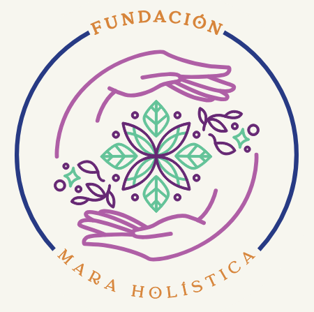

# Fundación Mara Holística — Sitio web

Sitio web de una sola página (one-page) para la Fundación Mara Holística.
Enfocado en **bienestar emocional y salud mental** mediante arteterapia y mindfulness,
con foco en madres cabeza de hogar de la Sabana de Bogotá. Incluye secciones de Inicio,
Quiénes somos, Programas, Galería/Testimonios y Contacto/Donaciones.

## Archivos

- `index.html` — estructura y contenido de la página
- `styles.css` — diseño y estilos (colores, tipografía, responsive)
- `script.js` — menú móvil, animaciones, contadores y validación del formulario

## Cómo verlo

Solo abre `index.html` en tu navegador (doble clic).
No necesita instalación ni servidor.

## Cómo personalizarlo

### 1. Logo
En `index.html`, dentro de `<a class="brand">`, reemplaza el emoji por tu logo:
```html

```
Coloca tu archivo `logo.png` en esta misma carpeta.

### 2. Colores de la marca
En `styles.css`, al inicio (sección `:root`), cambia estos valores por los tuyos:
```css
--morado: #a4498f;   /* color principal */
--menta:  #57c79a;   /* color secundario */
--azul:   #1f2f6b;   /* color oscuro */
--dorado: #d08a3e;   /* color de acento */
--crema:  #f5f1e6;   /* fondo */
```

### 3. Textos
Edita directamente los textos en `index.html` (misión, visión, programas,
testimonios, datos de contacto, redes sociales).

### 4. Fotos de la galería
Reemplaza los `<div class="gallery-item">` por imágenes reales:
```html
<div class="gallery-item"></div>
```

### 5. Formulario de contacto
Actualmente muestra una confirmación local. Para recibir los mensajes por correo,
puedes conectarlo con un servicio gratuito como **Formspree** o **Web3Forms**
(te puedo ayudar a configurarlo).

## Publicar gratis en internet

Puedes subir esta carpeta a:
- **Netlify** (netlify.com) — arrastra la carpeta y listo
- **GitHub Pages**
- **Vercel**

¿Necesitas ayuda con alguno de estos pasos? Pídemelo.
